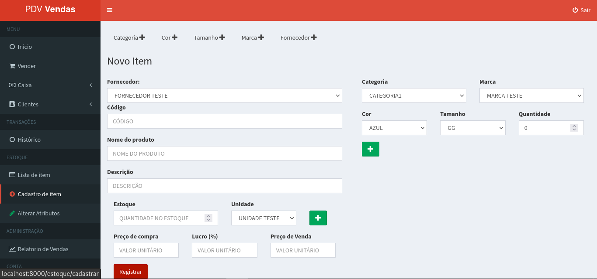

# PDV - Gestão de Ponto de Venda

Sistema PDV feito em PHP com Laravel para gestão de venda.

## Módulos

- Login
- Vendas
- Caixa
- Clientes
- Transações
- Estoque
- Produtos
- Relatório de Vendas

## Requisitos

- PHP >= 7.4.33
- MySql >= 5
- Composer

## Tecnologia

- PHP
- JS
- Jquery
- Json
- CSS and SCSS
- Bootstrap
- Composer
- Artisan
- Laravel

## Instalação

Crie um banco de dados com o nome "pdv" no seu Mysql.<br>
Abra o arquivo .env e efetue a configuração correta para conexão do seu banco de dados.<br>

```
$ mysql -u <your user> -p

mysql> create database `pdv`;
```

Após criado o banco de dados, abra o terminal e execute o seguinte comando:

```
$ ./install.sh
```

Caso de algum erro e não consiga instalar, execute os seguintes comandos separadamente:

```
$ composer install

$ php artisan key:generate

$ php artisan migrate

$ php artisan db:seed
```

Depois de realizado isso, rode o projeto:

```
$ php artisan serve
```

## Acesso ao Sistema 

Para acessar o sistema utilize o seguinte endereço:<br>
http://localhost:8000/

- Login: <br>
    - Usuário: admin<br>
    - Senha: admin

## Licença

Projeto licenciado sob <a href="LICENSE">The MIT License (MIT)</a>.

## Screenshots

 <br><br>
 <br><br>
 <br><br>
 <br><br>
 <br><br>
 <br><br>
 <br><br>
 <br><br>
 <br><br>
 <br><br>


Desenvolvido por<br>
Danilo Meneghel<br>
danilo.meneghel@gmail.com<br>
http://danilomeneghel.github.io/<br>
