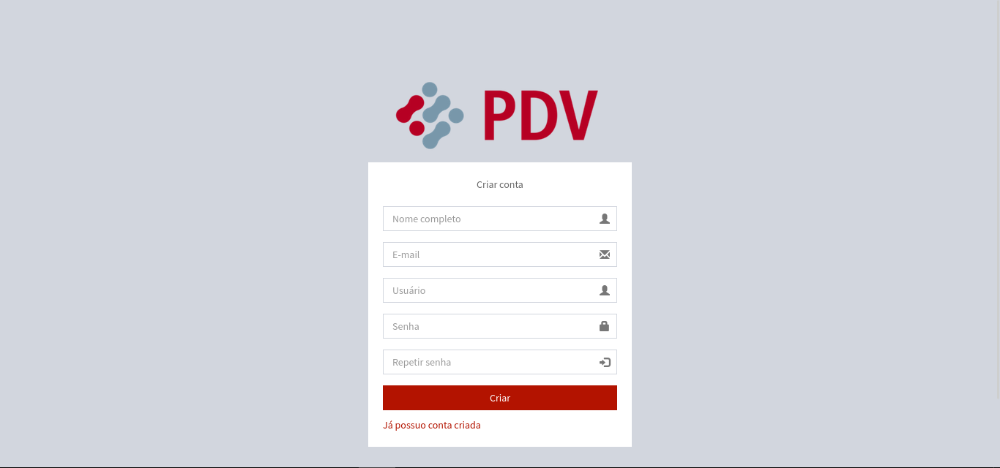
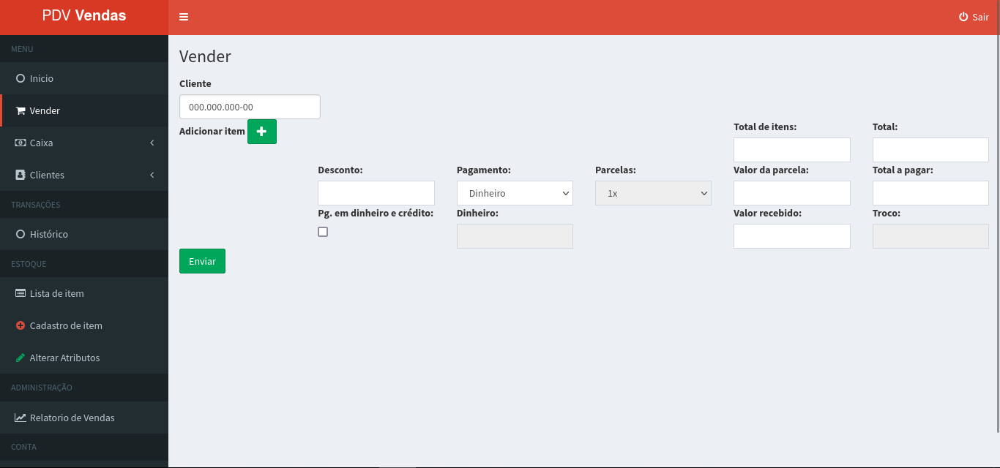
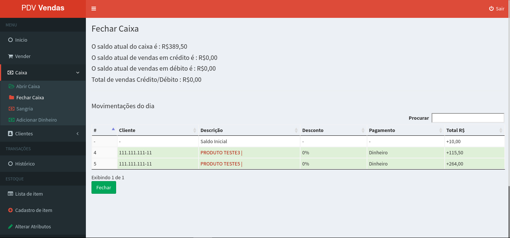

# PDV - Gestão de Ponto de Vendas

Sistema PDV feito em Laravel para gestão de vendas.

## Caracteríticas

- OAuth
- Login
- Rotas
- CRUD
- DataTable
- Filtro
- Paginador
- View Blade
- Responsivo

## Requisitos

- PHP >= 7.4.33
- MySql >=5
- Composer

## Tecnologia

- PHP
- JS
- Jquery
- Json
- CSS and SCSS
- Bootstrap
- Composer
- Artisan
- Laravel

## Instalação

Criar Banco de Dados Mysql com nome 'pdv':

```
$ mysql -u <your user> -p <your password>

mysql> create database `pdv`;
```
OBS: Editar o arquivo .env conforme os dados de conexão do banco de dados.<br>
Após configurar o banco, rodar o seguinte comando:

```
$ composer install

$ php artisan key:generate

$ php artisan migrate

$ php artisan db:seed

$ php artisan serve
```

## Acesso ao Sistema 

Para acessar o sistema utilize o seguinte endereço:<br>
http://localhost:8000/

- Login: <br>
    - Usuário: admin<br>
    - Senha: admin

## Licença

Projeto licenciado sob <a href="LICENSE">The MIT License (MIT)</a>.

## Screenshots

 <br><br>
 <br><br>
 <br><br>
 <br><br>
 <br><br>
 <br><br>
 <br><br>
 <br><br>
 <br><br>


Desenvolvido por<br>
Danilo Meneghel<br>
danilo.meneghel@gmail.com<br>
http://danilomeneghel.github.io/<br>
